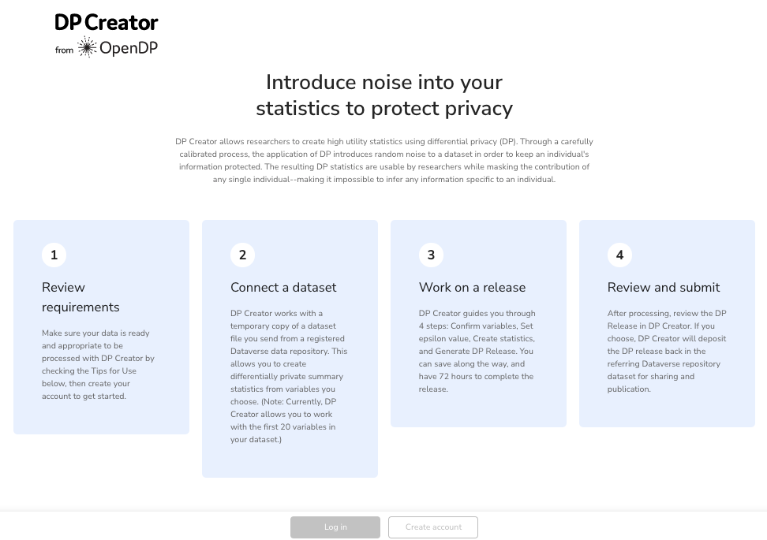

### Demo version!

A demo version of DP Creator is available which shows how it integrates with a [Dataverse repository](https://dataverse.org/). To try it, including uploading your own (non-sensitive) test data to Dataverse, please follow these instructions:
  - [DP Creator tutorial instructions](https://docs.google.com/document/d/e/2PACX-1vRlZ2IgigIhl4oz_uOakQPxovzlrmFkbD-x_9RUO31dC0eRq2wCt_vN2Go0_9LTRd67srjgy04CfPVk/pub)
    - Estimated time: 15 to 30 minutes
    - These instructions go through the entire process, beginning with creating a Dataverse account and depositing data there and finishing with using DP Creator to produce a a release of differentially private statistics.
  - Coming soon: Updated demo option where test data may be uploaded directly to DP Creator
Please feel free to [contact us](#contact--getting-help) with any questions or feedback.

---
# DP Creator

DP Creator is a web application which guides users in the creation of [differentially private statistics](https://opendp.org/about#whatisdifferentialprivacy). Using the [OpenDP library](https://github.com/opendp/opendp) at its core, DP Creator has been designed to work with data repositories, with initial integration beginning with [Dataverse](https://dataverse.org/), an open source research data repository. 

DP Creator is part of the larger [OpenDP Project](https://opendp.org), a community effort to build trustworthy, open source software tools for analysis of private data. 

## Status

The application is designed to be deployed using [kubernetes](https://kubernetes.io/) and the development environment is available through [Docker Compose](https://docs.docker.com/compose/).

Several screenshots of DP Creator appear below (click for a larger image):

&nbsp;
&nbsp;
&nbsp;

## Contact / Getting Help

If you would like to learn more or want to submit feedback, please reach out! Here are some ways to contact us:

* Joining the [dpcreator-dev channel](https://join.slack.com/t/opendp/shared_invite/zt-zw7o1k2s-dHg8NQE8WTfAGFnN_cwomA) in our Slack workspace
* Ask questions on our [discussions forum](https://github.com/opendp/opendp/discussions)
  * This forum is used for all of the OpenDP projects, including the [OpenDP library](https://github.com/opendp/opendp) and DP Creator. 
* Open issues on our [issue tracker](https://github.com/opendp/dpcreator/issues)
* Send general queries to [info@opendp.org](mailto:info@opendp.org?subject=DP%20Creator)
* Reach us on Twitter at [@opendp_org](https://twitter.com/opendp_org)

## Contributing

DP Creator is a community effort, and we welcome your contributions to its development! Our current technology stack/development environment includes [Vue.js](https://vuejs.org/), [Python](https://www.python.org/), and [Docker](https://www.docker.com/). If you'd like to participate, please reach out using the contact information above.
