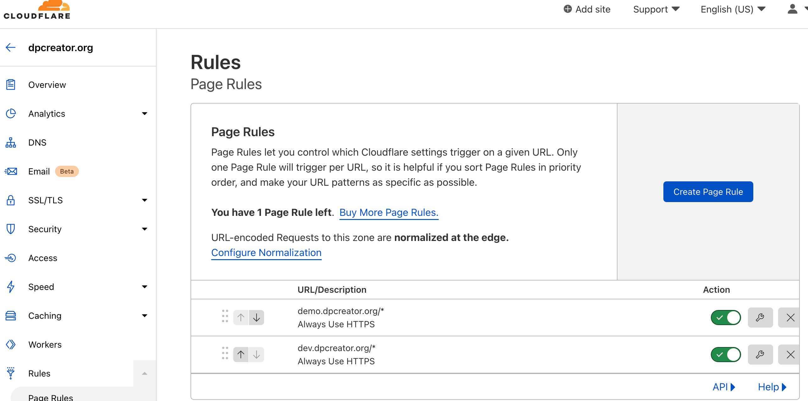

# Cloudflare configuration

The dev.dpcreator.org and demo.dpcreato.org deployments use Cloudflare or SSL. The underlying architecture is kubernetes fronted with an nginx container and a Django container for the main web app. e.g. The request sequence is then:
  - Cloudflare which forces SSL
    - __Within an Azure kubernetes deployment:__
      - LoadBalancer service
      - Nginx container 
      - Django web app container 

## Creation of the Cloudflare service

  - Login to [Cloudflare](https://www.cloudflare.com/) and click "+ Add Site"
  - Enter the domain name that will be used to host the site. (e.g. dpcreator.org)
  - Choose a plan 
    - (Note: Currently using the "Free" plan for demo/dev sites)
  - You will see a set of DNS records taken from the current registrar. Check these records against the registrar and make sure all the entries are there. Add any that are missing. 
  - Click continue
  - Select "Full encryption"
  - Scroll down and activate the switch that says "Always use HTTPS"

## DNS configuration 

**DP Creator configuration**
For each subdomain, we need to decide if CloudFlare should route its traffic. A row for the domain dev.dpcreator.org should look like: 

| Type      | Name    | Content        | Proxy Status | TTL |
|-----------|---------|----------------|----------|---------|
| A         |   dev   |   (ip address) | Proxied  |   auto  |

- Applies to: demo.dpcreator.org, dev.dpcreator.org

**Dataverse configuration**
For any subdomains which should not be routed through CloudFlare, they should be left as "DNS only" like so:

| Type      | Name    | Content        | Proxy Status | TTL     |
|-----------|---------|----------------|--------------|---------|
| A         |   demo  |  (ip address)  | DNS only     |   auto  |

- Applies to: demo-dataverse.dpcreator.org, dev-dataverse.dpcreator.org

The final DNS configuration should look like this:

## Page Rules

For the DP Creator application instances, add "Page Rules" so that requests to "http" will be forced to "https".

1. While on the "dpcreator" domain, use the left column menu
2. Select "Rules" -> "Page Rules"
3. Create the following Rules (one at a time):
  - Rule 1
    - URL: `demo.dpcreator.org/*`
    - Rule: `Always Use HTTPS`
  - Rule 2
    - URL: `dev.dpcreator.org/*`
    - Rule: `Always Use HTTPS`
4. The final DNS configuration should look like this:

